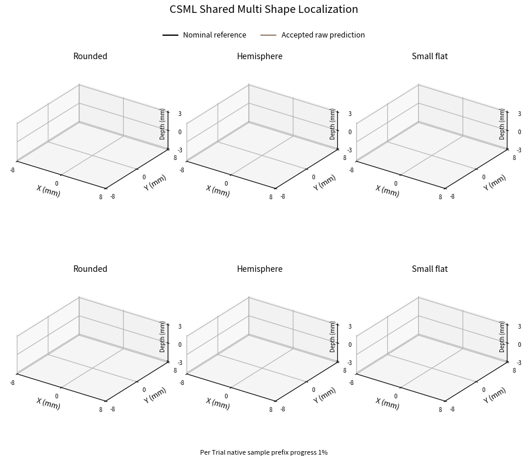
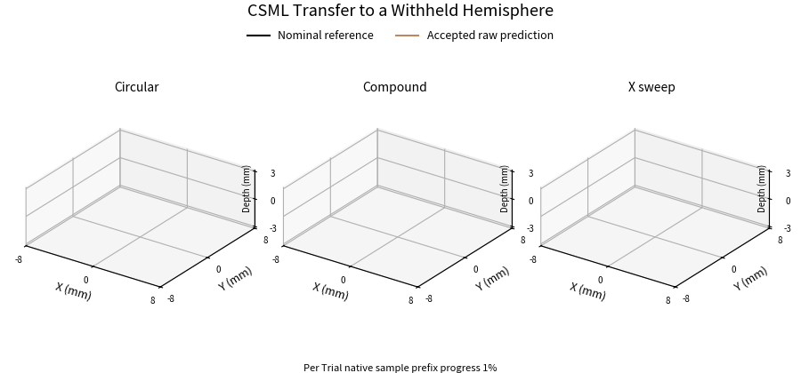

# Causal Spatiotemporal Magnetic Localization

[English manuscript](manuscripts/CSML_Research_Manuscript_EN.pdf) · [完整中文论文](manuscripts/CSML_Research_Manuscript_ZH.pdf) · [English editable text](manuscripts/CSML_Manuscript_EN.md) · [中文可编辑正文](manuscripts/CSML_Manuscript_ZH.md)

CSML estimates local contact position and relative indentation from magnetic history without an indenter identity or commanded-coordinate input. This repository accompanies **Causal Spatiotemporal Magnetic Localization across Contact Shapes**. The manuscript is a research draft, not a published or peer-reviewed article.

## Trajectory replay

### Shared multi-shape localization



### Transfer to a withheld hemisphere



Black denotes the nominal reference and orange denotes the model's accepted **raw** output. All panels use the same millimetre scale and orthographic view: X/Y ±8 mm and relative depth ±3.2 mm. Missing outputs remain gaps. Animation frames reveal native-sample prefixes; the panels show normalized per-Trial progress, not a synchronized physical experiment or a claim about real-time playback speed. No trajectory is shifted, smoothed, rotated or rescaled. The examples are post-hoc illustrations with visible output, not substitutes for the full evaluation population.

## Main evidence

| Protocol | Evaluation population | Raw mean error | Trial-aligned diagnostic mean | Accepted coverage |
|---|---|---:|---:|---:|
| Shared multi-shape configuration | 97 original validation Trials, 132,595 position targets across rounded, hemispherical and small-flat indenters | 0.234 mm | 0.201 mm | 97.94% |
| Shape-holdout configuration | 260 hemispherical Trials, 401,803 position targets | 0.729 mm | 0.539 mm | 79.70% |

The aligned column removes one reference-fitted constant XYZ offset per complete Trial **for evaluation only**. It is not a new online calibration or a change to model output. Raw causal replay is numerically equivalent to online inference for identical inputs and state. In the holdout population, 41.25% of accepted weighted position targets exceed 0.5 mm raw error; measurable geometry transfer does not imply universal reliability on arbitrary indenters.

The shared checkpoint was selected using the original four-domain development set. Its three-domain paper evaluation is not a separate untouched test set. The holdout model is trained and normalized using rounded and small-flat training Trials only, with development selection confined to those shapes. Hemisphere records do not enter its training or epoch selection, but the existing acquisition collection is not a newly collected blind test.

## Contents

- `manuscripts/`: English manuscript and complete Chinese translation; Word versions are added only after document-render review.
- `assets/`: bilingual scientific figures, trajectory GIFs and original indenter design meshes.
- `src/csml/`: original architecture and causal feature functions, extracted without changing their implementation.
- `models/`: the two fixed main inference configurations, three formal component-comparison state dictionaries, and their original normalization constants. No optimizer or private machine state is required for inference.
- `data/trials/`: byte-identical canonical NPZ input/reference records and their original label sidecars.
- `data/index.json`: whole-Trial shape, original role, source hash and provisional skin-risk exclusion mapping.
- `data/protocols.json`: exact shared and shape-holdout roles; original roles are preserved.
- `data/predictions/`: complete saved predictions for the two manuscript evaluation populations, including failures and rejected outputs.
- `data/cases/`: the nine frozen illustrative trajectories used for the paper and animations.
- `reproduction/`: full result tables, checkpoint provenance and immutable checksums.

The released canonical NPZs contain the recorded baseline-subtracted magnetic inputs and nominal references; they are **not a new raw-CSV or live-baseline reconstruction**. Raw acquisition CSVs and hardware-specific credentials/configurations are not included. Reference coordinates remain unchanged. The full canonical collection has 482 Trials; the shape-holdout protocol derives from 466 after conservatively flagging 16 late small-flat Trials. That flag is not a proven rupture time, and earlier silicone integrity remains unverified.

## Reproduce the saved-result evaluation

```bash
python -m pip install -r requirements.txt
python scripts/unpack_data.py
python scripts/evaluate_saved.py --protocol shared
python scripts/evaluate_saved.py --protocol holdout
```

Numeric arrays are distributed in checksum-verified ZIP shards under `data/archives/`; `unpack_data.py` restores the paths below without altering the original bytes.

These commands score frozen predictions without retraining or changing any acceptance threshold. Position scores include every fixed eligible target whether output is accepted or rejected. Aggregation gives equal weight to eligible Trials within each shape and equal weight to shapes; P95 and RMSE are means of Trial-level statistics, not pooled quantiles/RMSE.

## Run causal inference

```bash
python scripts/replay.py --model holdout --trial trial_0001 --output replay.npz
```

Select a released Trial identifier from `data/index.json`. The input interface consists of magnetic measurements, validity, native time increments and reset state. References, indenter shape and identifiers are never neural inputs. Loading a checkpoint is not hardware validation; the portable package retains the original model and feature functions, with strict tensor-by-tensor checkpoint checks. CPU versus GPU arithmetic or batching may produce small floating-point differences.

## Acquisition system and indenter geometry

The acquisition platform records five triaxial magnetic sensor nodes, native timing, baseline metadata and commanded motion references. Its implementation is documented in the separate [MagTouch acquisition-system repository](https://github.com/googo2025/MagTouch-RA-3d-trajectory-recon). That repository's historical estimator is not the CSML model reported here.

CAD files are original design meshes, not manufactured-shape metrology. Historical records support use of the same had239 physical magnetic specimen; differing Profile names alone do not establish a changed magnetic layer. Changes in mounting, baseline, nominal ContactZ and damaged silicone are not independently ruled out.

## Component comparisons

The manuscript includes the finalized static-only, no-slow-readout and no-increment-loss comparisons. Their 780 complete saved hemisphere predictions are included in `data/predictions/{static,no_slow,no_increment}/`. To score them, use the same `evaluate_saved.py` command with the corresponding protocol name. The static model has fewer parameters, and training doses differ because the finite stopping budgets differ. The slow readout did not establish a coordinate-accuracy benefit. See the manuscript's component-comparison table for the exact scope; unrelated exploratory runs are not presented as paper experiments.

This release reproduces inference and saved-result evaluation. It does not yet provide a portable end-to-end retraining entry point or claim bit-identical retraining from scratch. The original frozen training checkpoints and scientific execution records remain preserved separately.

## Licensing and citation

The repository owner initialized this repository with the MIT software license; the existing LICENSE is retained. No separate CC BY data/figure license has been added. Author names and affiliations are intentionally not invented. A publication DOI and final bibliographic citation will be added only when available.

中文说明和完整中文论文见 `manuscripts/`。中文轨迹动图为 `assets/shared_ZH.gif` 和 `assets/holdout_ZH.gif`。
